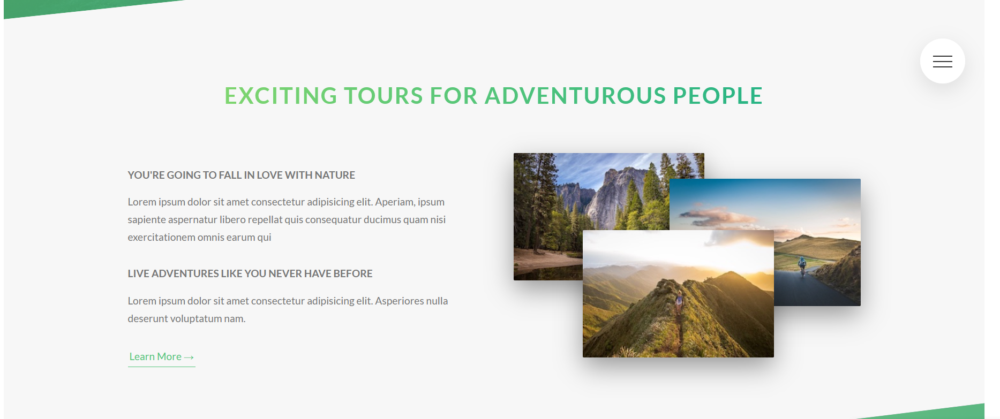

<p align="center">
  <a href="" rel="noopener">
 </a>
</p>

<h3 align="center">Natours</h3>

<div align="center">

[]()
[](/LICENSE)

</div>

---

<p align="center"> Exciting tours for adventurous people
    <br> 
</p>

## 📝 Table of Contents

- [About](#about)
- [Getting Started](#getting_started)
- [Deployment](#deployment)
- [Usage](#usage)
- [Built Using](#built_using)
- [Authors](#authors)
- [Acknowledgments](#acknowledgement)

## 🧐 About <a name = "about"></a>

The purpose of this project is to create a landing page for a company that sell tours packs to people.

## 🏁 Getting Started <a name = "getting_started"></a>

These instructions will get you a copy of the project up and running on your local machine for development and testing purposes. See [deployment](#deployment) for notes on how to deploy the project on a live system.

### Prerequisites

You will need to have [Nodejs](https://nodejs.org/en/) in your system.

Check the documentation to install it on your system.

### Installing

</a>

Once you have Node Js on your system. You can see in the package.json all the scripts.

```

"scripts": {
    "watch:sass": "node-sass sass/main.scss css/style.css -w",
    "devserver": "live-server",
    "start": "npm-run-all --parallel devserver watch:sass",
    "compile:sass": "node-sass sass/main.scss css/style.comp.css",
    "concat:css": "concat -o css/style.concat.css css/icon-font.css css/style.comp.css",
    "prefix:css": "postcss --use autoprefixer -b 'last 10 versions' css/style.concat.css -o css/style.prefix.css",
    "compress:css": "node-sass css/style.prefix.css css/style.css --output-style compressed",
    "build:css": "npm-run-all compile:sass concat:css prefix:css compress:css"
  },

package.json

```

## 🎈 Usage <a name="usage"></a>

You can make changes in the components inside the sass folder.
Run **npm watch:sass** to see in the browser all the changes that you do in the page.

## 🚀 Deployment <a name = "deployment"></a>

You can deploy this page to Netlify.

## ⛏️ Built Using <a name = "built_using"></a>

- [HTML](https://nodejs.org/en/) - Markup Language
- [CSS](https://nodejs.org/en/) - Stylesheets
- [SASS](https://sass-lang.com/) - CSS Preprocessor

## ✍️ Authors <a name = "authors"></a>

- [@fernandocutire](https://github.com/FernandoC1217) - Build by
- [@jonasschmedtmann](https://github.com/jonasschmedtmann) - Idea & Initial Work

## 🎉 Acknowledgements <a name = "acknowledgement"></a>

- CSS Udemy Jonas Course
- Natours
